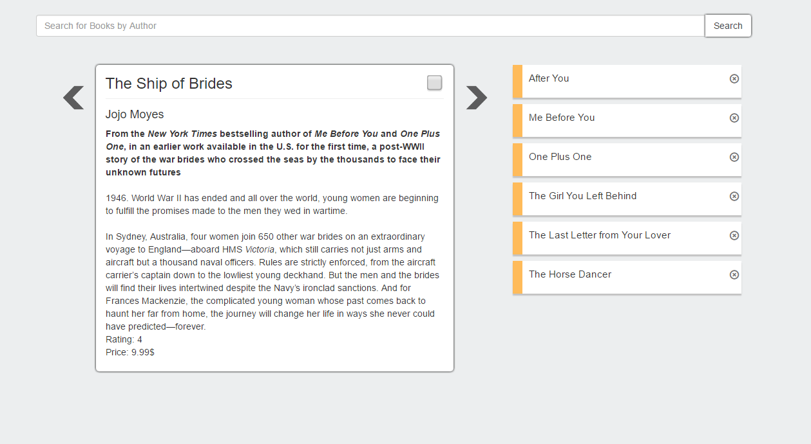

# Books-App
Simple Books App using react-redux, redux-thunk & jquery.

####How To Use#####
Checkout this repo, install dependencies, then start the gulp process with the following:

```
	> npm install
	> npm start
```
open http://localhost:8080/


####Screenshot####




